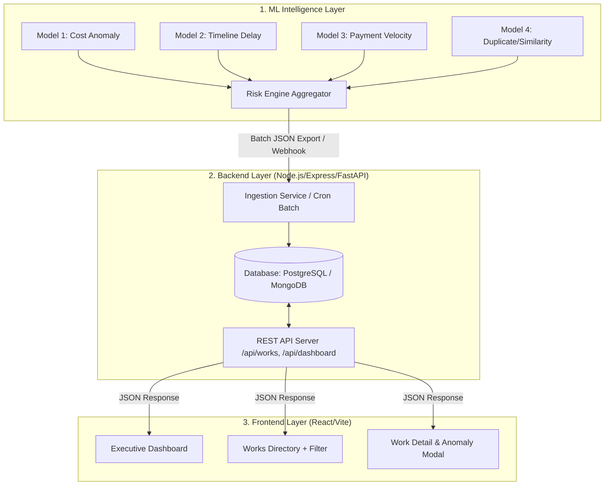

# NIRIKSHAN — End-to-End Data Contract & Integration Flow
### ML Output → Backend Ingestion → Frontend Presentation Guide

This document defines the exact data structures, API contracts, and UI display specifications so Backend and Frontend developers can build their respective modules in parallel.

---

## 1. High-Level System Architecture Flow



---

## 2. ML Model Output Specification (What ML Generates)

The ML pipeline runs batch scoring over all works and outputs a unified JSON object per work.

### Unified ML Risk Score Output Schema

```json
{
  "workId": "MPLADS-W-104928",
  "modelVersion": "nirikshan-ml-v1.0",
  "evaluatedAt": "2026-09-04T18:10:00Z",
  "overallRiskScore": 86,
  "riskLevel": "CRITICAL",
  "flags": [
    "COST_OVERRUN_RISK",
    "TIMELINE_DELAY_RISK",
    "POTENTIAL_DUPLICATE_WORK"
  ],
  "scores": {
    "costAnomalyScore": 92,
    "timelineDelayScore": 78,
    "paymentAnomalyScore": 45,
    "duplicateSimilarityScore": 89
  },
  "explainability": {
    "summary": "Work flagged due to 2.8x cost deviation over district peers and high similarity with an existing work in the same Gram Panchayat.",
    "evidence": [
      {
        "category": "COST",
        "severity": "HIGH",
        "title": "Cost Exceeds Peer Benchmark",
        "description": "Recommended amount (₹25,00,000) is 2.8× higher than the median cost (₹8,90,000) for Road Construction in Pune district.",
        "metrics": {
          "recommendedAmount": 2500000,
          "peerMedianAmount": 890000,
          "deviationRatio": 2.81
        }
      },
      {
        "category": "TIMELINE",
        "severity": "MEDIUM",
        "title": "Severe Sanction Delay",
        "description": "Elapsed 340 days between MP Recommendation and Nodal Sanction (Peer average: 85 days).",
        "metrics": {
          "recommendationToSanctionDays": 340,
          "peerAverageDays": 85
        }
      },
      {
        "category": "DUPLICATE",
        "severity": "HIGH",
        "title": "Potential Duplicate Work Detected",
        "description": "89% description match with Work ID 'MPLADS-W-08812' recommended in the same location in 2024.",
        "metrics": {
          "matchedWorkId": "MPLADS-W-08812",
          "similarityScore": 0.89,
          "matchedWorkDescription": "Construction of CC Road from Main Gate to Primary School"
        }
      }
    ]
  }
}
```

---

## 3. Backend Implementation (What Backend Receives & Serves)

### A. Database Storage Schema

#### `works` Table / Collection Schema
```sql
CREATE TABLE works (
    work_id VARCHAR(50) PRIMARY KEY,
    mp_id VARCHAR(50),
    mp_name VARCHAR(100),
    state VARCHAR(50),
    district VARCHAR(50),
    constituency VARCHAR(100),
    work_category VARCHAR(100),
    work_sub_category VARCHAR(100),
    work_description TEXT,
    recommended_amount NUMERIC(12,2),
    sanctioned_amount NUMERIC(12,2),
    expenditure_amount NUMERIC(12,2),
    work_status VARCHAR(50), -- Recommended, Sanctioned, In Progress, Completed
    recommendation_date DATE,
    sanction_date DATE,
    completion_date DATE,
    created_at TIMESTAMP DEFAULT CURRENT_TIMESTAMP
);
```

#### `risk_assessments` Table / Collection Schema
```sql
CREATE TABLE risk_assessments (
    id SERIAL PRIMARY KEY,
    work_id VARCHAR(50) REFERENCES works(work_id),
    overall_risk_score INT CHECK (overall_risk_score BETWEEN 0 AND 100),
    risk_level VARCHAR(20), -- LOW, MEDIUM, HIGH, CRITICAL
    cost_score INT,
    delay_score INT,
    payment_score INT,
    duplicate_score INT,
    flags JSONB,
    explainability JSONB,
    model_version VARCHAR(50),
    evaluated_at TIMESTAMP DEFAULT CURRENT_TIMESTAMP
);
```

---

### B. Backend REST API Contract for Frontend

#### 1. Dashboard Overview Metrics
- **`GET /api/dashboard/overview`**
- **Response**:
```json
{
  "success": true,
  "data": {
    "totalMonitoredWorks": 87272,
    "totalAllocatedBudget": 4363.60,
    "flaggedFundsAtRisk": 384.20,
    "riskDistribution": {
      "CRITICAL": 1420,
      "HIGH": 6850,
      "MEDIUM": 18400,
      "LOW": 60602
    },
    "recentAlertsCount": 42
  }
}
```

#### 2. Works Directory Table (Filtered & Paginated)
- **`GET /api/works?page=1&limit=10&riskLevel=CRITICAL&state=Maharashtra`**
- **Response**:
```json
{
  "success": true,
  "data": {
    "items": [
      {
        "workId": "MPLADS-W-104928",
        "mpName": "Sharad Pawar",
        "state": "Maharashtra",
        "district": "Pune",
        "workCategory": "Infrastructure",
        "workSubCategory": "Roads & Bridges",
        "workDescription": "Construction of CC Road in Village X",
        "recommendedAmount": 2500000,
        "workStatus": "Sanctioned",
        "overallRiskScore": 86,
        "riskLevel": "CRITICAL",
        "topFlags": ["Cost 2.8x Peer Avg", "Duplicate Candidate"]
      }
    ],
    "pagination": {
      "total": 1420,
      "page": 1,
      "limit": 10,
      "totalPages": 142
    }
  }
}
```

#### 3. Single Work Detail Endpoint (Populates Modal)
- **`GET /api/works/:workId`**
- Returns complete work metadata combined with `risk_assessments` explainability data.

---

## 4. Frontend Component & Display Specification (MVP UI)

### Screen 1: Executive Risk Dashboard
- **KPI Metrics Header**:
  - 📊 **Total Works Monitored**: `87,272`
  - 💰 **Total Budget Monitored**: `₹4,363.6 Cr`
  - 🚨 **Flagged Funds (High/Critical)**: `₹384.2 Cr`
  - 🔴 **Critical Works Requiring Action**: `1,420`
- **Charts**:
  - **Risk Distribution**: Doughnut Chart (Critical 🔴, High 🟠, Medium 🟡, Low 🟢).
  - **Top Anomaly Types**: Bar Chart (Cost Overruns, Timeline Delay, Potential Duplicate).

---

### Screen 2: Works Directory & Risk Inspector
- **Filters Header**:
  - Dropdowns: `State`, `District`, `Risk Level (Critical/High/Med/Low)`, `Category`.
  - Search Input: Search by Work ID, MP Name, or Keywords.
- **Data Table Columns**:
  1. `Work ID` (Clickable)
  2. `MP Name & Constituency`
  3. `Work Description & Category Badge`
  4. `Sanctioned Amount (₹)`
  5. `Risk Badge` (e.g., `<Badge color="red">86 - CRITICAL</Badge>`)
  6. `Key Indicators` (Pills showing top 2 flags)
  7. `Action` ("Inspect" button)

---

### Screen 3: Work Anomaly Inspector Modal (When clicking a Work)

```text
+-------------------------------------------------------------------------------+
|  WORK DETAILS: MPLADS-W-104928                               [X Close]        |
|  Construction of CC Road in Village X, Pune, Maharashtra                       |
+-------------------------------------------------------------------------------+
|                                                                               |
|  [ RISK OVERVIEW BADGE ]                                                      |
|  Score: 86 / 100  | LEVEL: CRITICAL 🔴                                         |
|                                                                               |
|  [ RISK SUB-SCORE BREAKDOWN ]                                                 |
|  Cost Anomaly Risk   : [==========================....] 92% (High)           |
|  Timeline Delay Risk : [======================........] 78% (Med-High)       |
|  Duplicate Risk      : [=========================.....] 89% (High)           |
|  Payment Anomaly Risk: [============..................] 45% (Low-Med)        |
|                                                                               |
|  ---------------------------------------------------------------------------  |
|  🔍 WHY FLAGGED? (AI Explainability & Evidence)                               |
|                                                                               |
|  ⚠️ 1. Cost Exceeds Peer Benchmark                                            |
|     Recommended: ₹25.0L  |  District Peer Median: ₹8.9L  (2.81x Higher)       |
|                                                                               |
|  ⏱️ 2. Severe Sanction Delay                                                  |
|     Elapsed Days to Sanction: 340 Days (Peer Avg: 85 Days)                    |
|                                                                               |
|  👯 3. Potential Duplicate Work Detected                                      |
|     89% text match with Work 'MPLADS-W-08812' in same Gram Panchayat          |
|                                                                               |
|  ---------------------------------------------------------------------------  |
|  [ ACTION BUTTONS ]                                                           |
|  [ Flag for Field Audit ]   [ Mark as False Positive ]   [ Download PDF Report]|
+-------------------------------------------------------------------------------+
```

---

## 5. Summary Checklist for Teammates

### Backend Developer Checklist
- [ ] Setup Database schema (`works` table and `risk_assessments` table).
- [ ] Create script/service to ingest ML JSON export into database.
- [ ] Build `/api/dashboard/overview` endpoint with aggregated counts.
- [ ] Build `/api/works` list endpoint with filters (`riskLevel`, `state`, `district`, `search`).
- [ ] Build `/api/works/:workId` detail endpoint returning work details + risk evidence JSON.

### Frontend Developer Checklist
- [ ] Build Dashboard KPI Cards & Charts (ApexCharts / Chart.js / Recharts).
- [ ] Build Works Table with filter bar and risk badges (`CRITICAL`, `HIGH`, `MEDIUM`, `LOW`).
- [ ] Build Work Inspector Modal / Drawer to render sub-scores and the bulleted explainability evidence array.
- [ ] Add Action Buttons ("Flag for Audit", "Export Report") to satisfy SIH presentation requirements.
